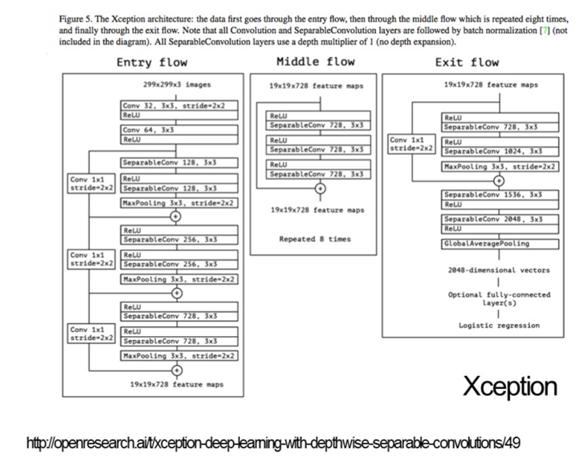
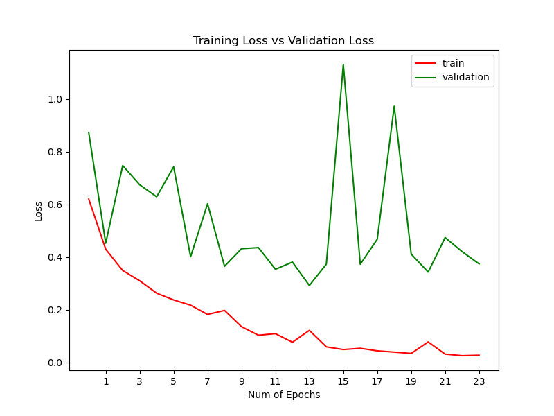
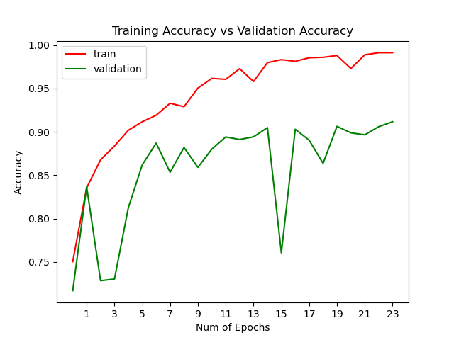

# Age-Detection-using-Xception

해당 모델은 Xception을 기반으로 한 연령대 판별 딥러닝 모델입니다.

위 모델은 안면 인식 기반 반응형 키오스크에 사용됩니다.

 

## 모델 개요

1~15, 26~64, 65~ 에 해당하는 3가지 연령대로 구분하여 사람의 얼굴을 판별합니다.

데이터셋을 openCV의 SSD 기반 Face detector로 규격에 맞게 얼굴 영역만 잘라내고

추가적인 전처리를 했습니다.

 

## 훈련 결과

val_loss: 0.3737

 

val_acc: 0.9117

 

## 테스트 결과

테스트 데이터셋 기준

91.59%